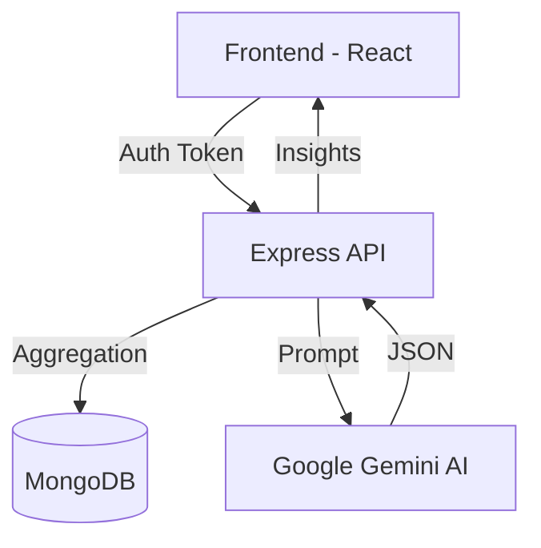

# 🧠 AI Notes Workspace


A premium, full-stack productivity platform that leverages **Google Gemini AI** to transform raw thoughts into structured intelligence. Featuring auto-save, semantic search, and an analytics command center.

[Live Demo](#) • [API Documentation](#api-routes) • [Installation](#installation)

---

## ✨ Features

### 🤖 Intelligence Layer (Powered by Gemini)
- **One-Click AI Insights**: Generate summaries, action items, and title suggestions in a single optimized request.
- **Semantic Understanding**: AI-driven categorization and content analysis.

### 📝 Core Workspace
- **Zen Editor**: A distraction-free, responsive markdown-style editor.
- **Smart Auto-Save**: Real-time persistence with optimistic UI updates.
- **Dynamic Organization**: Categorization, tagging, and archiving for multi-dimensional organization.

### 📊 Analytics & Sharing
- **Command Center**: Advanced dashboard with weekly activity charts and tag distribution analytics.
- **Public Sharing**: Secure, unauthenticated public access via unique shareable IDs.
- **Search Engine**: Lightning-fast keyword search across titles and content.

---

## 🛠️ Tech Stack

### Frontend
- **React (Vite)**: High-performance UI rendering.
- **Tailwind CSS**: Custom "Linear-style" design system.
- **Framer Motion**: Smooth page transitions and micro-interactions.
- **Axios**: Interceptor-based API communication.

### Backend
- **Node.js & Express**: Scalable RESTful API architecture.
- **MongoDB & Mongoose**: Aggregation-driven data modeling and indexing.
- **JWT & Bcrypt**: Secure token-based authentication and hashing.
- **Google Generative AI**: Native integration with Gemini 1.5 Flash.

---

## 🏗️ Architecture

The project follows a modular **Controller-Service-Repository** style pattern on the backend and a **Feature-Based** architecture on the frontend.



---

## 🚀 Installation

1. **Clone the Repo**
   ```bash
   git clone https://github.com/yourusername/ai-notes-workspace.git
   ```

2. **Backend Setup**
   ```bash
   cd backend
   npm install
   # Create .env based on .env.example
   npm run dev
   ```

3. **Frontend Setup**
   ```bash
   cd frontend
   npm install
   # Create .env based on .env.example
   npm run dev
   ```

---

## 🔑 Environment Variables

### Backend
- `MONGO_URI`: MongoDB connection string.
- `JWT_SECRET`: Secret for token signing.
- `GEMINI_API_KEY`: Google AI Studio API key.
- `FRONTEND_URL`: URL of your deployed frontend.

### Frontend
- `VITE_API_URL`: URL of your deployed backend.

---

## 📡 API Routes

### Authentication
- `POST /api/auth/signup` - Register new user
- `POST /api/auth/login` - Authenticate user
- `GET /api/auth/me` - Validate session

### Notes
- `GET /api/notes` - Fetch user notes (filtered/sorted)
- `POST /api/notes` - Create new note
- `PATCH /api/notes/:id` - Partial update (auto-save)
- `DELETE /api/notes/:id` - Permanent removal
- `PATCH /api/notes/archive/:id` - Toggle archive status

### AI & Sharing
- `POST /api/notes/:id/generate-ai` - Unified Gemini insights
- `GET /api/notes/shared/:shareId` - Public access route

---

## 🛣️ Future Roadmap
- [ ] Collaborative real-time editing (WebSockets)
- [ ] Mobile App (React Native)
- [ ] AI-powered note grouping and clustering
- [ ] Export to PDF/Markdown

---

## 📄 License
Distributed under the MIT License. See `LICENSE` for more information.

---
Built with ❤️ by [Your Name]
