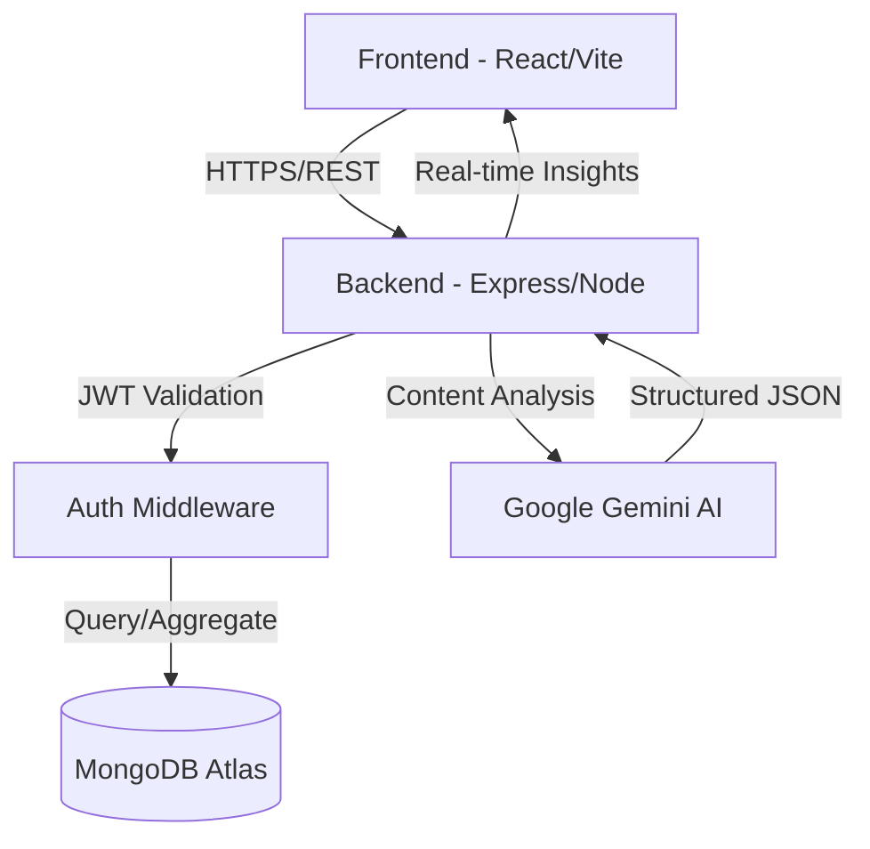

# 🧠 AI Notes Workspace — Your Intelligent Second Brain

[](https://reactjs.org/)
[](https://nodejs.org/)
[](https://www.mongodb.com/)
[](https://tailwindcss.com/)
[](https://vitejs.dev/)
[](https://ai.google.dev/)
[](https://opensource.org/licenses/MIT)

> **Elevate your productivity with an AI-powered workspace that summarizes, organizes, and analyzes your thoughts in real-time.**

AI Notes Workspace is a production-grade, full-stack SaaS application designed for modern thinkers and creators. It transforms the traditional note-taking experience into an intelligent collaboration between human intuition and machine intelligence. Built as part of a high-performance internship assignment, this platform showcases advanced full-stack capabilities, secure authentication, and native AI integration.

---

## 🎬 Live Demonstration

| Service | Status | Link |
| :--- | :--- | :--- |
| **Frontend Web App** | 🟢 Live | [View Live Demo](https://ai-notes-workspace-frontend.vercel.app) |
| **Backend API** | 🟢 Operational | [API Health Check](https://ai-notes-workspace-backend.onrender.com) |
| **Video Walkthrough** | 🎥 Watch | [YouTube Demo](https://youtube.com/watch?v=example) |

---
---

## 🚀 Key Features

### 🔐 Secure Authentication
- **JWT-Powered**: Stateless authentication using JSON Web Tokens.
- **bcryptjs Hashing**: Industry-standard password encryption.
- **Persistent Sessions**: Seamless login persistence across reloads.
- **Protected Routes**: Granular access control for all private resources.

### ✍️ Advanced Note Management
- **Rich Editor**: Optimized for speed and clarity with markdown-style aesthetics.
- **Auto-Save Engine**: Debounced background persistence to prevent data loss.
- **Organization**: Powerful categorization and multi-tag support.
- **Search & Filter**: Server-side keyword search and semantic filtering.

### 🤖 Gemini AI Integration
- **Smart Summaries**: Transform long meeting minutes into 3 concise sentences.
- **Task Extraction**: Automatically extract actionable items and to-dos.
- **Suggested Titles**: Let AI rename your notes based on content context.
- **Intelligent Fallback**: Multi-model fallback logic (Pro/Flash) for high availability.

### 📊 Professional Dashboard
- **Usage Analytics**: Track your AI requests and note-taking habits.
- **Tag Clouds**: Visualize your most-used themes and categories.
- **Weekly Activity**: Heatmap-style charts for productivity tracking.

### 🌍 Public Sharing
- **Unique Share IDs**: Secure, obfuscated IDs for public note access.
- **Privacy Toggle**: Instantly make notes public or private.
- **Read-Only UI**: Clean, unauthenticated view for shared stakeholders.

---

## 🛠️ Technology Stack

### Frontend Architecture
| Tech | Purpose | Logo |
| :--- | :--- | :---: |
| **React** | Component-based UI Library |  |
| **Vite** | Next-gen Frontend Tooling |  |
| **Tailwind CSS** | Utility-first Design Framework |  |
| **Framer Motion** | Premium Animations & Transitions |  |
| **Context API** | Global State Management |  |

### Backend Infrastructure
| Tech | Purpose | Logo |
| :--- | :--- | :---: |
| **Node.js** | JavaScript Runtime |  |
| **Express.js** | Minimalist Web Framework |  |
| **MongoDB** | NoSQL Document Database |  |
| **Mongoose** | Elegant MongoDB Modeling |  |
| **JWT** | Secure Authentication |  |

---

## 🏗️ System Architecture



### Request Lifecycle
1. **Frontend** captures user input and triggers a debounced `PATCH` request.
2. **Middleware** verifies the JWT from the `Authorization` header.
3. **Controller** processes the request, communicating with **Mongoose** for data persistence.
4. **AI Service** (if triggered) prompts **Gemini** with the note content.
5. **JSON Parser** cleans the AI response and returns a unified state to the **Frontend**.

---

## 📂 Folder Structure

### Frontend (`/frontend`)
```text
frontend/
├── src/
│   ├── components/  # Reusable UI elements (Buttons, Cards, Modals)
│   ├── pages/       # Page-level components (Dashboard, Editor, Login)
│   ├── context/     # Global state (AuthContext, ToastContext)
│   ├── layouts/     # Page structural wrappers (MainLayout)
│   ├── services/    # API instance and endpoint definitions
│   ├── hooks/       # Custom React hooks (useAuth, useLocalStorage)
│   ├── assets/      # Static images, icons, and global styles
│   └── utils/       # Helper functions and formatters
```

### Backend (`/backend`)
```text
backend/
├── controllers/     # Core business logic for Notes, Users, and AI
├── models/          # Mongoose Schemas (User, Note, AIAnalytics)
├── routes/          # API endpoint definitions and mounting
├── middleware/      # Auth guard and error handling logic
├── config/          # Database and environmental configuration
├── services/        # Third-party integrations (Gemini API)
└── utils/           # Shared backend utilities (Token generation)
```

---

## 📡 API Documentation

### Authentication Endpoints
| Method | Endpoint | Description | Auth |
| :--- | :--- | :--- | :---: |
| `POST` | `/api/auth/signup` | Register a new user | 🔓 |
| `POST` | `/api/auth/login` | Login and get JWT | 🔓 |
| `GET` | `/api/auth/me` | Fetch current user session | 🔐 |

### Note Management Endpoints
| Method | Endpoint | Description | Auth |
| :--- | :--- | :--- | :---: |
| `GET` | `/api/notes` | Get all notes (Search/Filter) | 🔐 |
| `POST` | `/api/notes` | Create a new blank note | 🔐 |
| `PATCH` | `/api/notes/:id` | Update note content (Auto-save) | 🔐 |
| `DELETE` | `/api/notes/:id` | Permanent note deletion | 🔐 |
| `POST` | `/api/notes/:id/generate-ai` | Trigger AI Insights | 🔐 |

### Public Access
| Method | Endpoint | Description | Auth |
| :--- | :--- | :--- | :---: |
| `GET` | `/api/notes/shared/:shareId` | Access a public note | 🔓 |

---

## 🗄️ Database Schema

### User Model
```json
{
  "name": "string",
  "email": "string (unique)",
  "password": "hashed_string",
  "createdAt": "timestamp"
}
```

### Note Model
```json
{
  "userId": "ObjectId (ref: User)",
  "title": "string",
  "content": "string",
  "tags": ["string"],
  "category": "string",
  "archived": "boolean",
  "shared": "boolean",
  "shareId": "string (unique)",
  "aiGeneratedSummary": "string",
  "aiActionItems": ["string"]
}
```

---

## 🔧 Installation & Setup

### Prerequisites
- Node.js (v16.x or higher)
- MongoDB Atlas Account
- Google AI Studio API Key (Gemini)

### 1. Clone the Repository
```bash
git clone https://github.com/amankv1234/ai-notes-workspace.git
cd ai-notes-workspace
```

### 2. Backend Configuration
```bash
cd backend
npm install
```
Create a `.env` file:
```env
PORT=5000
MONGO_URI=your_mongodb_atlas_uri
JWT_SECRET=your_jwt_signing_secret
GEMINI_API_KEY=your_google_gemini_key
FRONTEND_URL=http://localhost:5173
```
Run the server:
```bash
npm run dev
```

### 3. Frontend Configuration
```bash
cd ../frontend
npm install
```
Create a `.env` file:
```env
VITE_API_URL=http://localhost:5000
```
Run the client:
```bash
npm run dev
```

---

## 🚀 Deployment

### Backend (Render)
1. Create a new **Web Service** on Render.
2. Link your GitHub repository.
3. Set the build command to `npm install`.
4. Set the start command to `npm start`.
5. Add all `.env` variables in the **Environment** tab.

### Frontend (Vercel)
1. Create a new project on Vercel.
2. Link the repository and set the root directory to `frontend`.
3. Framework preset: **Vite**.
4. Set `VITE_API_URL` as an environment variable pointing to your Render URL.

---

## 🛡️ Security & Performance
- **Data Safety**: All API requests are validated; users can only access their own notes.
- **JWT Security**: Tokens are signed with a robust secret and verified via custom middleware.
- **Optimized Queries**: MongoDB indexes on `userId` and `archived` for O(1) retrieval.
- **Frontend Optimization**: Debounced auto-save reduces network overhead and prevents DB thrashing.

---

## 🗺️ Roadmap
- [ ] **Real-time Collaboration**: Multi-user editing using Socket.io.
- [ ] **Markdown Support**: Advanced formatting with preview mode.
- [ ] **Voice Notes**: Speech-to-text AI integration.
- [ ] **Dark/Light Mode**: User-controlled theme switching.
- [ ] **Mobile App**: Cross-platform application using React Native.

---

## 🤝 Contribution
Contributions are welcome! If you have a feature request or a bug fix:
1. Fork the Project.
2. Create your Feature Branch (`git checkout -b feature/AmazingFeature`).
3. Commit your Changes (`git commit -m 'Add some AmazingFeature'`).
4. Push to the Branch (`git push origin feature/AmazingFeature`).
5. Open a Pull Request.

---

## 📄 License
Distributed under the MIT License. See `LICENSE` for more information.

---

## 👤 Author
**Aman Kumar**
- GitHub: [@amankv1234](https://github.com/amankv1234)
- LinkedIn: [Aman Kumar][(https://linkedin.com/in/aman-kumar](https://www.linkedin.com/in/aman-kumar-vishwakarma-08b223304/))
- Email: amankumarvishwakarma767@gmail.com

---

## 🙏 Acknowledgements
- **Peblo** for the internship challenge and product vision.
- **Google Generative AI** for providing the Gemini API.
- **The React Community** for the incredible ecosystem.

<div align="center">
  <br />
  <p>Made with ❤️ by Aman Kumar</p>
  <b>Empowering thoughts with Intelligence.</b>
</div>
