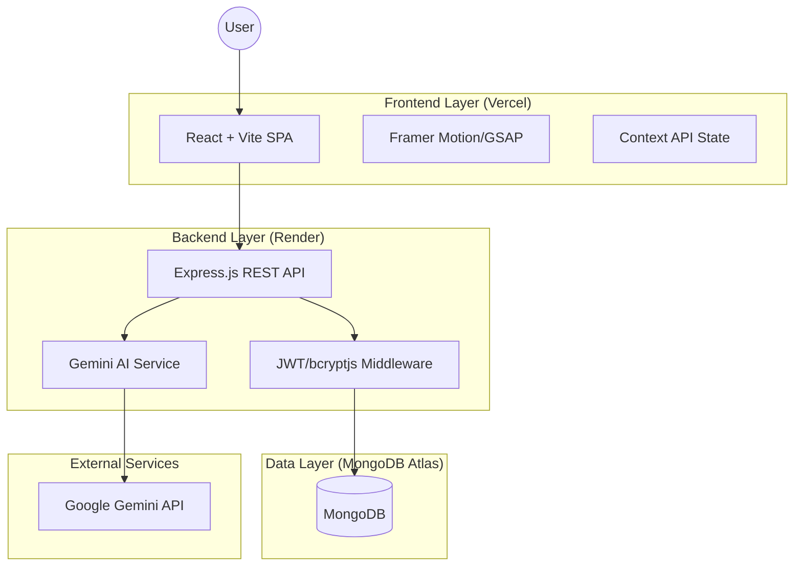
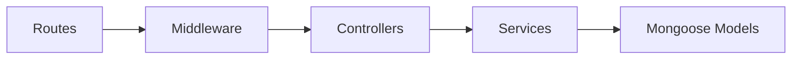
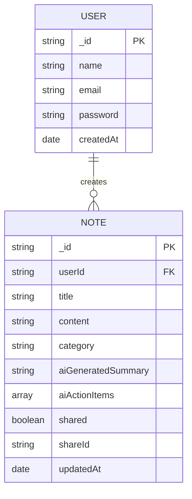
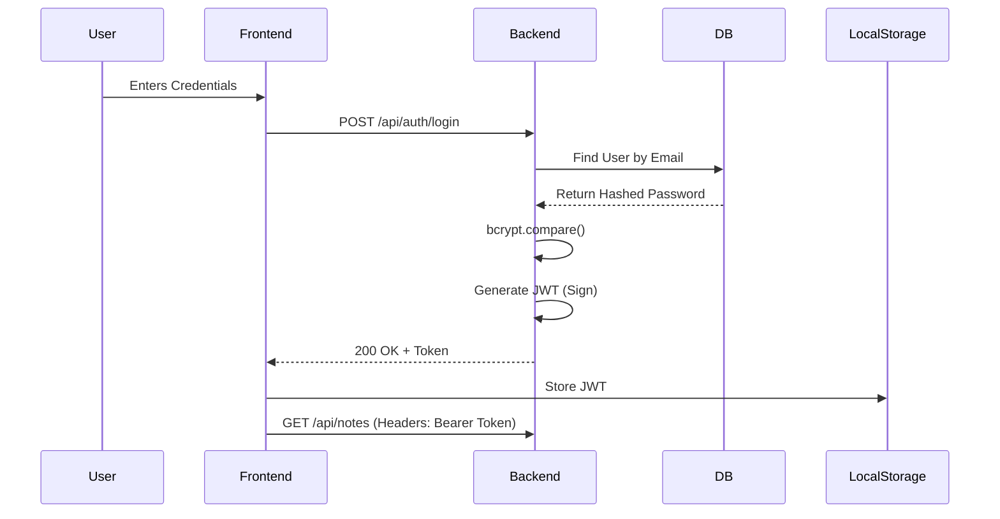
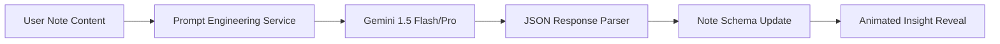

# 🧠 Peblo: AI Notes Workspace Architecture Documentation

Peblo is a high-performance, AI-integrated note-taking platform designed for modern productivity. This document outlines the technical architecture, system design, and engineering patterns implemented in the Peblo ecosystem.

---

## 1. Project Introduction

### Purpose
Peblo is engineered to bridge the gap between static note-taking and intelligent knowledge management. It transforms raw thoughts into structured, actionable insights using state-of-the-art Large Language Models (LLMs).

### Application Goals
*   **Intelligent Synthesis**: Automatically generate summaries and action items from unstructured text.
*   **High-End UX**: Provide a premium, distraction-free environment with advanced animations and glassmorphism.
*   **Seamless Organization**: Leverage a "Neural Archive" approach for tagging and categorization.
*   **Production Reliability**: Ensure secure, authenticated access with real-time data persistence.

### Product Vision
The vision for Peblo is to become a "Neural Second Brain"—an extension of the user's consciousness that doesn't just store information but understands and enhances it through continuous AI analysis.

---

## 2. System Architecture Overview

Peblo follows a **Decoupled Client-Server Architecture** optimized for scalability and performance.

### High-Level System Design


### Request Flow
1.  **Client Request**: React frontend initiates an Axios request to the REST API.
2.  **Middleware**: Express server validates JWT tokens and sanitizes input.
3.  **Controller Logic**: Business logic processes the request (CRUD or AI triggers).
4.  **Service Layer**: Interacts with MongoDB or the Gemini API.
5.  **Response**: Formatted JSON response sent back to the client for UI updates.

---

## 3. Frontend Architecture

The frontend is built with **React 18** and **Vite**, prioritizing rendering speed and interactive fidelity.

### Component Philosophy
Peblo uses an **Atomic Design** approach with reusable UI components and specialized page containers.

### Folder Structure
```text
frontend/src/
├── assets/          # Static assets (images, global fonts)
├── components/      # Reusable UI atoms (Buttons, Cards, Loaders)
├── context/         # Global state (Auth, Toast, UI Theme)
├── hooks/           # Custom React hooks for data fetching
├── layouts/         # Page wrappers (MainLayout, AuthLayout)
├── pages/           # Route-level components (Dashboard, Editor)
├── services/        # Axios API instances and interceptors
├── utils/           # Helper functions (Date formatting, String manipulation)
└── App.jsx          # Route definitions and provider wrapping
```

### State Management & Routing
*   **Context API**: Handles global authentication state and notification (toast) systems.
*   **React Router DOM**: Manages client-side routing with **Protected Routes** to ensure secure access.
*   **Framer Motion + GSAP**: Orchestrates complex layout transitions and micro-animations for a premium feel.

---

## 4. Backend Architecture

A robust **Node.js/Express** server follows a modular "Controller-Service-Route" pattern.

### Layered Structure


### Backend Folder Structure
```text
backend/
├── config/          # DB connection and env configurations
├── controllers/     # Request handling and response logic
├── middleware/      # Auth validation, Error handling, Logging
├── models/          # Mongoose Schemas (User, Note)
├── routes/          # API endpoint definitions
├── services/        # Third-party integrations (Gemini API)
└── index.js         # Entry point and server initialization
```

---

## 5. Database Architecture

Peblo utilizes **MongoDB** for its flexible schema-less nature, allowing for rapid iteration of note structures and AI metadata.

### Entity Relationship Diagram


### Indexing Strategy
*   **Search Optimization**: Text indexing on `title` and `content` for high-performance searching.
*   **Relationship Indexing**: Indexed `userId` for O(1) retrieval of user-specific notes.
*   **Unique Constraints**: Unique indices on `email` and `shareId`.

---

## 6. Authentication Flow

Security is implemented using **JWT (JSON Web Tokens)** and **bcryptjs** for credential protection.

### Sequence Diagram


---

## 7. Notes Management Flow

The notes system is optimized for real-time capture and "Neural Archive" organization.

### Request Lifecycle
1.  **Auto-Save**: The editor utilizes a **debounce (1500ms)** mechanism to persist changes without overwhelming the database.
2.  **Neural Category**: Users can categorize notes (Idea, Research, Meeting) for multi-dimensional filtering.
3.  **Archive System**: Soft-deletion mechanism allows for data recovery while keeping the primary workspace clean.

---

## 8. AI Integration Architecture

The **Intelligence Layer** is the core differentiator, leveraging the Google Gemini Pro model.

### AI Processing Pipeline


### AI Workflow
*   **Prompt Engineering**: Context-aware prompts ensure the AI extracts high-quality summaries and specific action items.
*   **Response Formatting**: Backend services validate the AI output to ensure consistency with the frontend UI expectations.

---

## 9. Public Sharing System

Peblo allows for seamless collaboration through controlled public links.

| Feature | Implementation |
| :--- | :--- |
| **Share ID** | Cryptographically secure random ID generation. |
| **Access Control** | Notes are only accessible via public route if `shared` flag is `true`. |
| **Security** | Public endpoints return only note content, stripping sensitive user metadata. |

---

## 10. Dashboard Analytics Architecture

The dashboard provides a "Neural Command Center" overview of user productivity.

*   **Cognitive Activity**: Aggregation queries calculate note volume over the last 7 days.
*   **AI Utilization**: Tracks the percentage of notes optimized by the Neural Engine.
*   **Recent Insights**: Real-time feed of the latest AI-generated summaries.

---

## 11. API Design

| Endpoint | Method | Description | Auth |
| :--- | :--- | :--- | :--- |
| `/api/auth/register` | POST | Create a new user account | No |
| `/api/auth/login` | POST | Authenticate user and return token | No |
| `/api/notes` | GET | Fetch all notes for current user | Yes |
| `/api/notes` | POST | Create a new blank note | Yes |
| `/api/notes/:id` | PATCH | Update note content (Title/Content/Shared) | Yes |
| `/api/notes/:id/generate-ai`| POST | Trigger Gemini analysis (Summary/Action Items) | Yes |
| `/api/notes/share/:id` | GET | Publicly accessible note content | No |

---

## 12. Security Architecture

1.  **Data at Rest**: All sensitive user information is stored in MongoDB Atlas with VPC peering and IP whitelisting.
2.  **Data in Transit**: Secured via TLS/SSL (HTTPS) enforced by Vercel and Render.
3.  **Cross-Origin**: CORS policies strictly limited to production domains.
4.  **Environment Security**: All secrets (API Keys, JWT Secrets) managed via encrypted env variables.

---

## 13. Performance Optimization

*   **Component Lazy Loading**: Reduces initial bundle size for faster time-to-interactive.
*   **Debounced Input**: Prevents unnecessary network overhead during active writing sessions.
*   **Optimized Assets**: Modern image formats and minified CSS modules via Vite.
*   **Database Query Optimization**: Selective field retrieval (projections) to minimize payload sizes.

---

## 14. Deployment Architecture

Peblo utilizes a modern CI/CD pipeline for high availability.

*   **Frontend**: Hosted on **Vercel** with Edge Network caching.
*   **Backend**: Hosted on **Render** (Node.js Web Service) with auto-scaling.
*   **Database**: **MongoDB Atlas** (Shared Cluster) with automated backups.

---

## 15. Scalability Considerations

*   **Stateless API**: The backend is completely stateless, allowing for horizontal scaling behind a load balancer.
*   **WebSocket Integration**: Future-proofing for real-time collaborative editing.
*   **Caching Layer**: Planned implementation of **Redis** for frequently accessed public shared notes.

---

## 16. Future Roadmap

1.  **Neural Chat**: A side-panel AI assistant to query your entire archive via RAG (Retrieval-Augmented Generation).
2.  **Semantic Search**: AI-powered search that finds notes by meaning rather than just keywords.
3.  **Offline Persistence**: PWA capabilities for note-taking in zero-connectivity environments.
4.  **Team Workspace**: Shared organizational neural networks for teams and companies.

---

*Generated for the Peblo Engineering Team. 2026.*
